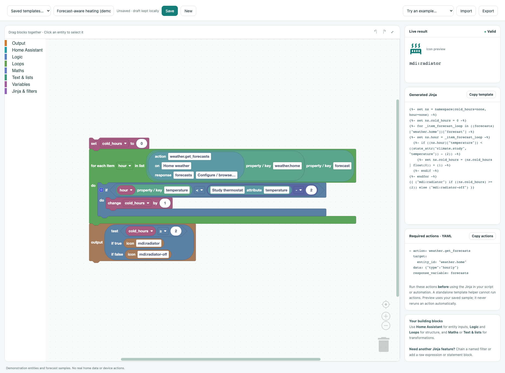
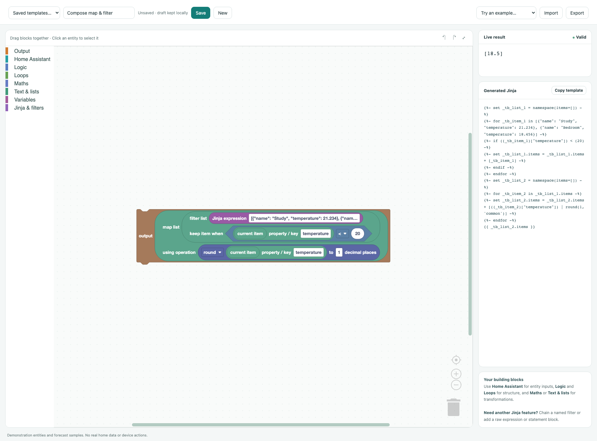

# Jinja Studio for Home Assistant

A Blockly editor that generates ordinary Home Assistant Jinja templates. Select
entities by friendly name or ID, compose logic and transformations, and inspect
the result alongside the generated source.



The screenshot shows a running editor with demonstration entities and a sample
forecast—not real home data. It counts cold forecast hours against a thermostat
setpoint, then selects the radiator icon. Choose **Forecast-aware heating (demo)**
under Examples to explore the same workspace.

## Install with HACS

Requires Home Assistant **2026.8 or newer** and an administrator account.

1. In HACS, open **⋮ → Custom repositories**.
2. Add `https://github.com/nielstron/ha_jinja_studio`, category **Integration**.
3. Download **Jinja Studio**, then restart Home Assistant.
4. Open **Settings → Devices & services → Add integration → Jinja Studio**.
5. Refresh your browser, then open **Settings → Tools → Jinja Studio**.

[Add repository to HACS](https://my.home-assistant.io/redirect/hacs_repository/?owner=nielstron&repository=ha_jinja_studio&category=integration)

Built frontend files are included; HACS users do not need Node.js or a build step.

### Tools-tab compatibility

HA does not currently expose a public API for registering Tools tabs. Jinja
Studio uses a small, isolated frontend hook for the current `ha-panel-tools` and
`tools-router` components. It adds a route without replacing built-in tabs or
modifying HA files. Future HA frontend changes may require an integration update.
If the tab is missing, the independent admin-only panel at **`/jinja-studio`**
remains available. No extra sidebar entry is added.

## Local preview

```sh
npm ci
npm run build
python3 dev/capture_snapshot.py
uv run python dev/capture_services.py
uv run python dev/server.py
```

Open <http://localhost:8766>. The capture script reads the HA instance at
`niels@homeassistant-64` over SSH. Entity states and named projects are stored in
the gitignored `.dev/` directory. No credentials are stored in the snapshot.
The server binds only to localhost.

For a privacy-safe demo without an HA snapshot, open
<http://localhost:8766/?demo=1> and select **Forecast-aware heating (demo)**.

The local preview uses Jinja's sandbox and a snapshot implementation of common
Home Assistant functions and filters. It does not include HA's full template
environment (for example, areas, integration-specific functions, custom template
imports and every HA filter). The installed integration uses Home Assistant's
own live `render_template` subscription instead, including automatic updates
when referenced entities change.

## Blocks

- Output values or literal text; chain outputs to build a message.
- Material Design Icon blocks with a searchable visual picker (names, aliases and
  categories), plus color blocks with a color wheel, Material palette and hex
  input. Icons output `mdi:…` strings; colors output hex strings or RGB lists.
  Both work in conditional expressions, loops and variables. The preview shows
  the resulting icon or color alongside its actual value. Icons are bundled
  locally and loaded on demand, with no CDN dependency.
- Entity states, numeric states with fallback, attributes, state comparisons,
  availability, domain entity lists and current time.
- Drill-down attribute picker with breadcrumbs, nested dictionary/list browsing,
  and automatic property/index blocks. Structured JSON strings are recognized
  and get a `from_json` block when you select a decoded value. Containers can also
  be selected whole for loops, filters or further processing.
- Action-response inputs (for example `weather.get_forecasts`): configure the
  action, target, JSON data and response variable, explicitly fetch or paste a
  sample, then browse it using the same picker. Samples travel with saved/exported
  workspaces. Preview uses those samples and never automatically executes actions.
- Conditions, and/or/not, comparisons, ternary expressions, membership and tests.
- For-each loops, ranges and loop metadata. Variables use a Jinja namespace so
  accumulators survive iterations and nested conditions.
- Arithmetic, powers, rounding, modulo, clamping, trig, logarithms, constants,
  prime checks and list statistics.
- Strings, replacement, splitting, joining, slicing, lists, indexing,
  dictionaries and property access.
- Composable **Map list** and **Filter list** blocks with operation/predicate
  sockets: reuse the same attribute, string, maths and logic blocks for each
  item. Use **Current item** explicitly, or leave a unary operation's value
  socket empty to use it implicitly. Nested maps/filters keep their own item
  scope. Generated templates use native Jinja loops and lists, retaining HA
  state objects rather than converting through JSON.
- Any named Jinja/HA filter, test or function, plus raw expression and raw
  statement blocks for features without a dedicated visual block.
  Click a filter name or its options to see actual registered signatures,
  named arguments and defaults, typed values, attribute/test choices and the
  two built-in `map` modes. Lazy filters such as `map` and `selectattr` are
  materialized as lists instead of displaying generator objects.

Drag insertion follows the cursor rather than the dragged block's connector.
Only dropping the cursor inside the visible trash can deletes blocks; dropping
onto the toolbox returns the block to its starting position. Undo can restore
deleted blocks.



Raw blocks are escape hatches, not a reverse parser. Existing arbitrary Jinja
cannot automatically be converted into blocks. Save/export the workspace to
keep it visually editable. Copying the generated Jinja works anywhere HA accepts
a template; copying it does not create or modify an entity.

Use **Save** for named projects. Unsaved drafts also survive a page reload in
the current browser. **Import/Export** moves workspaces between the local editor
and Home Assistant. The **Examples** menu includes entity values, maths,
conditions, loops and string manipulation.

Try **Conditional icon** or **Conditional color** to select an output based on an
entity state. Find the icon and color blocks under **Output**. Connect them to an
output block (or branches of a conditional expression), then click their value
to open the picker. Use the color block's format dropdown for hex or RGB output.
Use the generated icon template in an HA icon field; color templates require a
destination/card that supports them. Generating a color does not change the HA
theme or an entity's icon color automatically.

### Weather forecasts and other action responses

Try **Weather forecast (fetch sample)** in the Examples menu. Click the block's
**Configure / browse…** field. **Choose available action…** opens a searchable
catalog of actions registered in your HA instance, filtered to response-producing
actions by default. You can inspect other actions too, but those without response
data cannot be selected as template inputs. Input fields and declared defaults
are shown after selection; changing actions asks before replacing existing data.
The installed panel reads the live action registry, while local mode uses
`dev/capture_services.py` to capture it without executing any actions.

Choose your weather entity, then **Run action &
fetch sample** and **Save & browse response**. Browse the weather entity key,
`forecast`, `[0]`, then `temperature`. You can also select a whole forecast list
and connect it to a loop or filter.

Copy **Required actions · YAML** into your script or automation *before* the step
that uses the generated Jinja. Response variables only exist after those actions
run; a standalone template helper cannot run actions. Sample data is only for
editor preview and is not embedded in the generated template.

In local mode, fetching is limited to read-only `weather.get_forecasts` over SSH
to `niels@homeassistant-64`; paste sample JSON for other actions. In the installed
HA panel, fetching explicitly invokes the configured action via HA's WebSocket
API. Non-weather actions require confirmation because some may change devices.
Response data can contain private information: exported workspaces include it.

## Install as a custom integration

1. Build the frontend, or use an already-built copy of this repository.
2. Copy `custom_components/jinja_studio` into HA's `custom_components`.
3. Restart Home Assistant.
4. Under **Settings → Devices & services → Add integration**, select
   **Jinja Studio**.
5. Refresh the browser and open **Settings → Tools → Jinja Studio** (or
   `/jinja-studio` directly).

The panel and project API are admin-only. It serves its Blockly bundle and media
locally, without a CDN or cloud service. Saved projects are persisted in HA's
`.storage/jinja_studio`.

## Development

```sh
npm test
npm run build
uv run --group dev ruff check custom_components dev
uv run --group dev ruff format --check custom_components dev
```

After frontend changes, rebuild and refresh the browser. Generated Jinja tests
cover precedence, escaping, branching, persistent loop variables, mathematical
helpers and the shipped examples.
